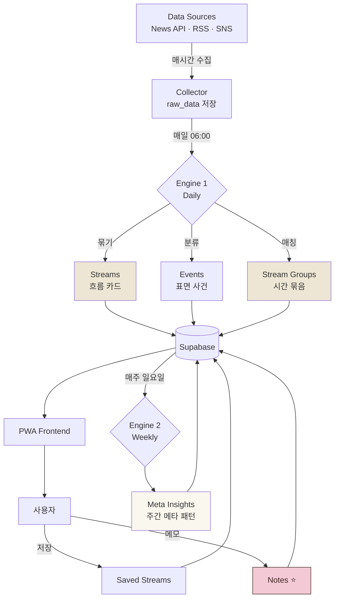
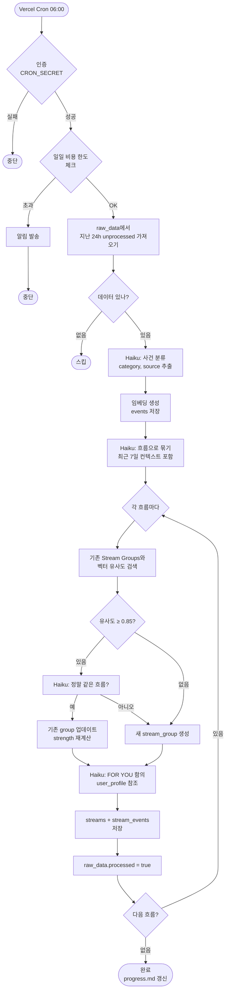
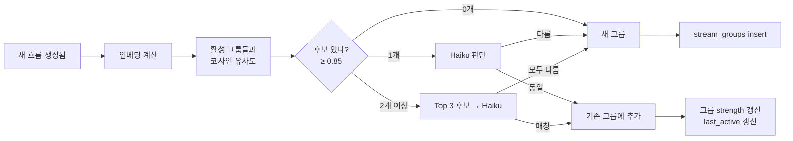
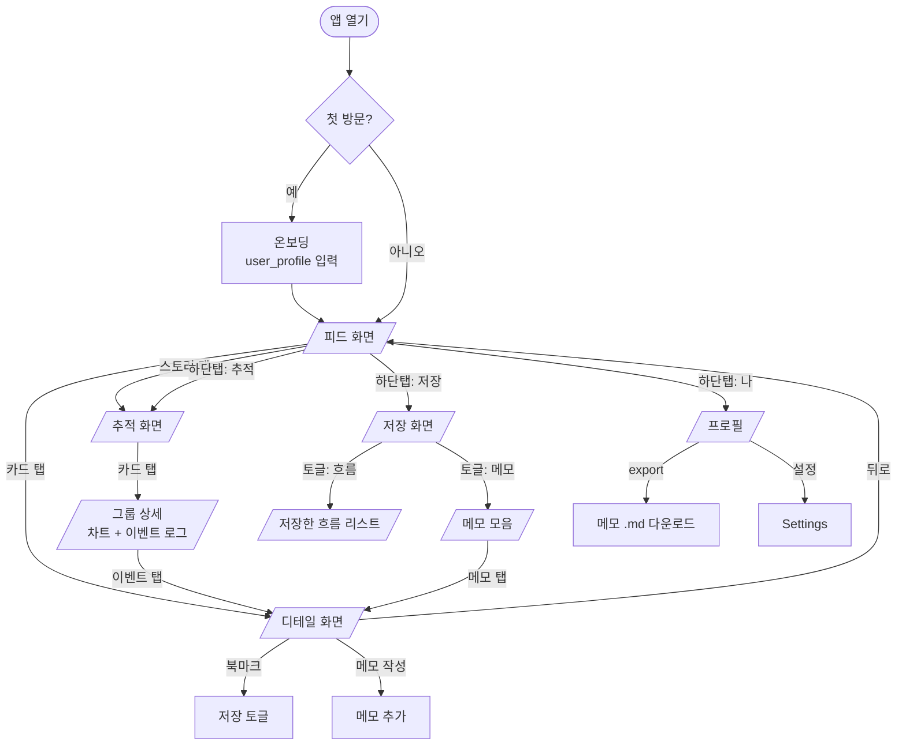
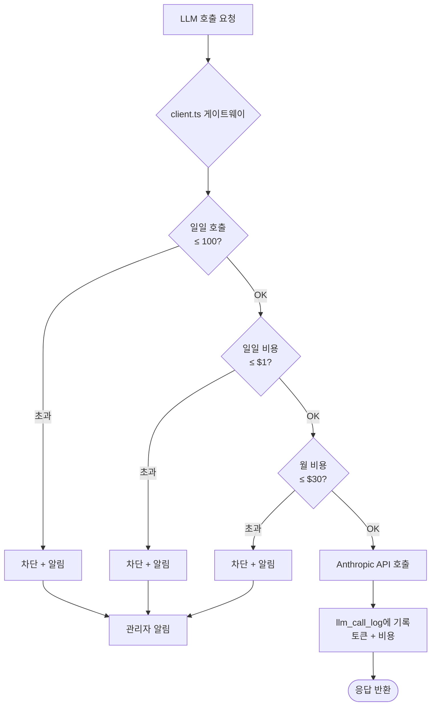
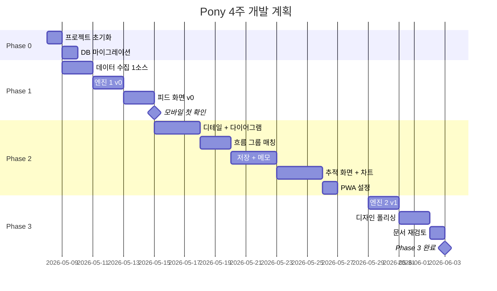

# 플로우차트

## 1. 데이터 흐름 (전체)

```mermaid
flowchart TD
    A[Data Sources<br/>News API · RSS · SNS] -->|매시간 수집| B[Collector<br/>raw_data 저장]
    B -->|매일 06:00| C{Engine 1<br/>Daily}
    C -->|분류| D[Events<br/>표면 사건]
    C -->|묶기| E[Streams<br/>흐름 카드]
    C -->|매칭| F[Stream Groups<br/>시간 묶음]
    
    E --> G[(Supabase)]
    D --> G
    F --> G
    
    G --> H[PWA Frontend]
    H --> I[사용자]
    I -->|저장| J[Saved Streams]
    I -->|메모| K[Notes ⭐]
    J --> G
    K --> G
    
    G -->|매주 일요일| L{Engine 2<br/>Weekly}
    L --> M[Meta Insights<br/>주간 메타 패턴]
    M --> G
    
    style K fill:#F4C9D6,stroke:#3E2723,color:#3E2723
    style E fill:#EDE6D4
    style F fill:#EDE6D4
    style M fill:#FAF7EE
```

## 2. 엔진 1 — 일일 흐름 감지 상세

```mermaid
flowchart TD
    Start([Vercel Cron 06:00]) --> Auth{인증<br/>CRON_SECRET}
    Auth -->|실패| End1([중단])
    Auth -->|성공| Cost{일일 비용 한도<br/>체크}
    Cost -->|초과| Alert[알림 발송] --> End2([중단])
    Cost -->|OK| Fetch[raw_data에서<br/>지난 24h unprocessed 가져오기]
    
    Fetch --> Empty{데이터 있나?}
    Empty -->|없음| End3([스킵])
    Empty -->|있음| Classify[Haiku: 사건 분류<br/>category, source 추출]
    
    Classify --> Embed1[임베딩 생성<br/>events 저장]
    Embed1 --> Form[Haiku: 흐름으로 묶기<br/>최근 7일 컨텍스트 포함]
    
    Form --> Loop{각 흐름마다}
    Loop --> Match[기존 Stream Groups와<br/>벡터 유사도 검색]
    Match --> Decide{유사도 ≥ 0.85?}
    Decide -->|있음| Confirm[Haiku: 정말 같은 흐름?]
    Confirm -->|예| Update[기존 group 업데이트<br/>strength 재계산]
    Confirm -->|아니오| New
    Decide -->|없음| New[새 stream_group 생성]
    
    Update --> ForYou
    New --> ForYou[Haiku: FOR YOU 함의<br/>user_profile 참조]
    
    ForYou --> Save[streams + stream_events<br/>저장]
    Save --> Mark[raw_data.processed = true]
    Mark --> NextLoop{다음 흐름?}
    NextLoop -->|있음| Loop
    NextLoop -->|없음| Done([완료<br/>progress.md 갱신])
```

## 3. 흐름 그룹 매칭 로직

```mermaid
flowchart LR
    A[새 흐름 생성됨] --> B[임베딩 계산]
    B --> C[활성 그룹들과<br/>코사인 유사도]
    C --> D{후보 있나?<br/>≥ 0.85}
    D -->|0개| F[새 그룹]
    D -->|1개| G[Haiku 판단]
    D -->|2개 이상| H[Top 3 후보 → Haiku]
    
    G -->|동일| I[기존 그룹에 추가]
    G -->|다름| F
    H -->|매칭| I
    H -->|모두 다름| F
    
    I --> J[그룹 strength 갱신<br/>last_active 갱신]
    F --> K[stream_groups insert]
```

## 4. 사용자 화면 플로우

```mermaid
flowchart TD
    Open([앱 열기]) --> Onboard{첫 방문?}
    Onboard -->|예| OB[온보딩<br/>user_profile 입력]
    OB --> Feed
    Onboard -->|아니오| Feed[/피드 화면/]
    
    Feed -->|카드 탭| Detail[/디테일 화면/]
    Feed -->|스토리 탭| Track[/추적 화면/]
    Feed -->|하단탭: 추적| Track
    Feed -->|하단탭: 저장| Saved[/저장 화면/]
    Feed -->|하단탭: 나| Profile[/프로필/]
    
    Detail -->|북마크| ToggleSave[저장 토글]
    Detail -->|메모 작성| AddNote[메모 추가]
    Detail -->|뒤로| Feed
    
    Track -->|카드 탭| TrackDetail[/그룹 상세<br/>차트 + 이벤트 로그/]
    TrackDetail -->|이벤트 탭| Detail
    
    Saved -->|토글: 흐름| SavedStreams[/저장한 흐름 리스트/]
    Saved -->|토글: 메모| NotesView[/메모 모음/]
    NotesView -->|메모 탭| Detail
    
    Profile -->|export| Export[메모 .md 다운로드]
    Profile -->|설정| Settings
```

## 5. 비용 안전장치

```mermaid
flowchart TD
    Call[LLM 호출 요청] --> Gate{client.ts 게이트웨이}
    Gate --> Check1{일일 호출<br/>≤ 100?}
    Check1 -->|초과| Block1[차단 + 알림]
    Check1 -->|OK| Check2{일일 비용<br/>≤ $1?}
    Check2 -->|초과| Block2[차단 + 알림]
    Check2 -->|OK| Check3{월 비용<br/>≤ $30?}
    Check3 -->|초과| Block3[차단 + 알림]
    Check3 -->|OK| Execute[Anthropic API 호출]
    
    Execute --> Log[llm_call_log에 기록<br/>토큰 + 비용]
    Log --> Return([응답 반환])
    
    Block1 --> Notify[관리자 알림]
    Block2 --> Notify
    Block3 --> Notify
```

## 6. Phase별 작업 흐름

```mermaid
gantt
    title Pony 4주 개발 계획
    dateFormat  YYYY-MM-DD
    section Phase 0
    프로젝트 초기화           :p0, 2026-05-08, 1d
    DB 마이그레이션           :after p0, 1d
    
    section Phase 1
    데이터 수집 1소스         :p1a, 2026-05-09, 2d
    엔진 1 v0                 :p1b, after p1a, 2d
    피드 화면 v0              :p1c, after p1b, 2d
    모바일 첫 확인            :milestone, after p1c, 0d
    
    section Phase 2
    디테일 + 다이어그램       :p2a, 2026-05-15, 3d
    흐름 그룹 매칭            :p2b, after p2a, 2d
    저장 + 메모               :p2c, after p2b, 3d
    추적 화면 + 차트          :p2d, after p2c, 3d
    PWA 설정                  :p2e, after p2d, 1d
    
    section Phase 3
    엔진 2 v1                 :p3a, 2026-05-29, 2d
    디자인 폴리싱             :p3b, after p3a, 2d
    문서 재검토               :p3c, after p3b, 1d
    Phase 3 완료              :milestone, after p3c, 0d
```
